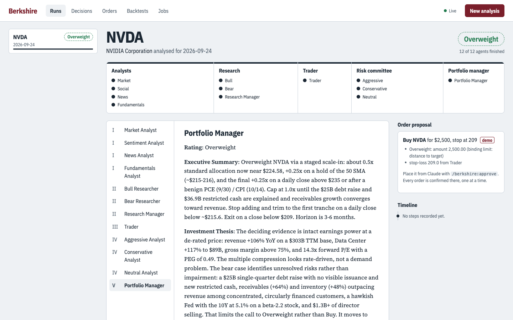
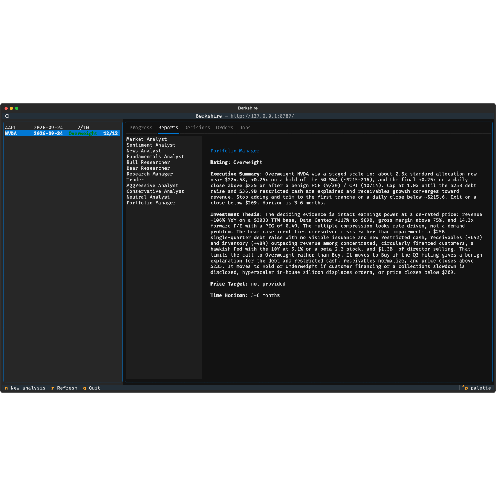

# Berkshire

A Claude Code plugin that runs a [TradingAgents](../TradingAgents)-style trading firm as
Claude subagents: an analyst team, a bull/bear research debate, a trader, a three-way risk
debate and a portfolio manager. It keeps a decision log that settles and reflects on past
calls, and puts a deterministic risk gate in front of **human-approved** order execution on
eToro through the eToro MCP.

> Research tooling, not financial advice. Every order needs your explicit approval, and the default account is **demo**.

## Commands

| Command | What it does | TradingAgents equivalent |
|---|---|---|
| `/berkshire:analyze [TICKER] [DATE] [--analysts …] [--depth shallow\|medium\|deep] [--language L] [--portfolio FILE\|etoro] [--checkpoint] [--clear-checkpoints]` | One multi-agent analysis. Interactive when run without arguments. Can queue an order at the end. | `tradingagents` CLI / `propagate()` |
| `/berkshire:tick` | One scheduled cycle over eToro holdings plus your watchlist: settle → analyse → risk gate → queue → notify | *(new)* |
| `/loop 24h /berkshire:tick` | Run the cycle once per day | *(new)* |
| `/berkshire:approve` | Review queued orders; `prepare-trade` / `place-trade` one approval at a time | *(new)* |
| `/berkshire:backtest TICKERS --start --end [--every N] [--run-id ID]` | Grid run in an isolated home, scored by rating | `tradingagents backtest` |
| `/berkshire:dashboard` or `berkshire web --open` | The web view: live progress, reports, decision log, queue, backtests, and starting new analyses | the live Rich panel |
| `berkshire tui` | The same views in the terminal (Textual) | the live Rich panel |

## Web and terminal views



One local server, `berkshire serve`, owns the state, and every view is a client of its HTTP + SSE API.
It is the same split as matlab-engine-mcp's web terminal and mtui:

```
 browser (React + Vite) ─┐                         ┌─ ~/.berkshire/runs/*/state.json
                         ├─ HTTP + SSE ─► berkshire serve ─┼─ memory/trading_memory.md, queue.json
 terminal (Textual)  ────┘  127.0.0.1, token       └─ jobs: claude -p /berkshire:analyze …
```

* **The floor** at the top of each analysis shows the five teams, one seat per agent. Seats fill as agents
  finish, and the page updates live without a reload. Below it are the report reader, the step timeline,
  and the risk gate's order proposal.
* **Starting an analysis** from either view runs `/berkshire:analyze` headless in Claude Code.
  **Placing orders is not possible from the views**: eToro's per-order confirmation happens only in
  Claude with `/berkshire:approve`.
* **Security** follows matlab-engine-mcp's web server. It binds to 127.0.0.1, sends no CORS headers, and
  requires the `X-WebUI` header and a per-process token (handed over as `?t=` once, and kept in the 0600
  registry `~/.berkshire/server.json` for the TUI). A non-loopback Host is refused, and report text is never
  rendered as HTML.
* `berkshire web` and `berkshire tui` start the server when none is running. The TUI needs the optional extra
  (`uv sync --extra tui`); the engine and the web view do not.



Web UI development: `cd webui && npm ci && npm run dev` (Vite proxies `/api` to `berkshire serve`).
`npm run build` produces `webui/dist`, which the server serves.

## How it works

```
/berkshire:analyze ──► berkshire init ──► loop: berkshire next ─► Agent(role) ×N ─► berkshire submit
                                                   ▲                                   │
                                                   └───────────── state.json ◄─────────┘
 roles (agents/*.md)                   engine (berkshire/, pytest-tested)
 market · sentiment · news · fundamentals   routing = TradingAgents conditional logic
 bull ⇄ bear → research manager (opus)      context grounding (identity, absent reports, openings)
 trader → aggressive → conservative → neutral  JSON schemas + REVIEW-safe rating parser
 portfolio manager (opus) · reflector      decision log + settlement, point-in-time data
                                            risk gate → approval queue → eToro MCP
```

* The **engine** (`berkshire` CLI, Python) owns everything that must be exact: routing,
  prompts/context, schema validation, the decision log, date clamping, sizing, and the queue.
* The **roles** are Claude subagents. The engine writes each role's context to a prompt file,
  and the agent writes its answer to an output file. The orchestrating skill only dispatches.
* **Data** comes from yfinance through `berkshire data --run RUN …`, clamped to the analysis date.
  Web search covers news, macro and social sources. eToro supplies live quotes, the portfolio and eligibility.

## Rating → order (risk gate, all limits in `~/.berkshire/config.json` or `BERKSHIRE_*`)

| Rating | Order |
|---|---|
| Buy / Overweight | Buy toward 100 % / 50 % of `target_weight` (5 %). Capped by `max_order_pct` 5 %, `max_instrument_pct` 15 %, and the `min_cash_pct` 10 % floor. Stop-loss = the Trader's stop, else ask − 2×ATR, else veto. Take-profit = the PM's price target. |
| Hold / REVIEW | No order (REVIEW is flagged for you) |
| Underweight / Sell | Close 50 % / 100 % of directly held positions |

Long only, leverage 1, at most 5 orders per tick. Queue items expire after 24 h.

## Install

```bash
# uv is required; the engine's environment is created on first use
claude --plugin-dir /Users/kai/repos/ai/berkshire          # dev
# or: /plugin marketplace add /Users/kai/repos/ai/berkshire ; /plugin install berkshire@berkshire-local
```

State lives in `~/.berkshire/`: `runs/<TICKER>/<DATE>/` (state, prompts, outputs, reports),
`memory/trading_memory.md` (same format as TradingAgents), `queue.json`, and `config.json`.

## Docs and tests

* [docs/tradingagents-analysis.md](docs/tradingagents-analysis.md): analysis of the source framework
* [docs/requirements.md](docs/requirements.md): every requirement (`REQ-*`) and the recorded design decisions
* [docs/design.md](docs/design.md): engine modules, run lifecycle, home layout and the tick
* [docs/test-plan.md](docs/test-plan.md): strategy, test cases (`TST-*`), manual procedures, and the REQ→TST matrix
* [docs/upstream.md](docs/upstream.md): the upstream TradingAgents ledger, kept by `/upstream-scout`, with reports in [docs/upstream-reports/](docs/upstream-reports/)
* [AGENTS.md](AGENTS.md): the change discipline and local gates, for agents and people

```bash
uv run --all-extras pytest --cov   # offline, ~8 s; coverage floor and traceability check included
cd webui && npm test               # web view unit tests
uvx ruff@0.16.5 check .            # lint, same pinned version as CI
```

## CI

`.github/workflows/ci.yml` runs on every push and pull request to `main`. It follows matlab-tui's pipeline:

| Job | What it proves |
|---|---|
| `test` | The full suite with every extra, under branch coverage. It fails below the floor in `pyproject.toml`, which only ratchets up. Publishes `coverage.xml` and a summary. |
| `core` | Without the optional `tui` extra: textual is absent, the suite passes, and `berkshire tui` explains the extra. |
| `lint` | Pinned ruff with the explicit rules in `ruff.toml`, including bandit security checks. |
| `webui` | `npm ci`, the node unit tests, and `vite build`. |
| `secrets` | gitleaks over the full git history. |
| `sast` | CodeQL for Python and JavaScript (security-extended). |
